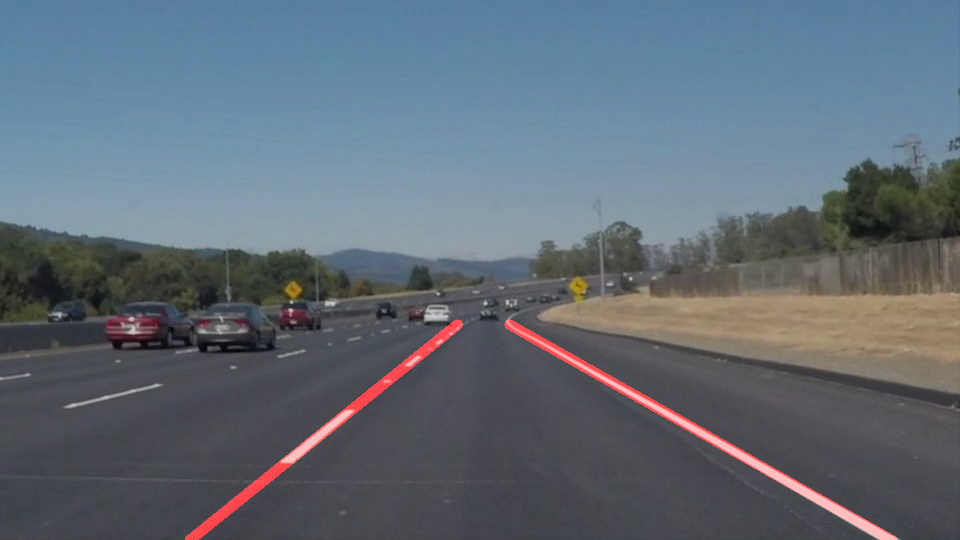
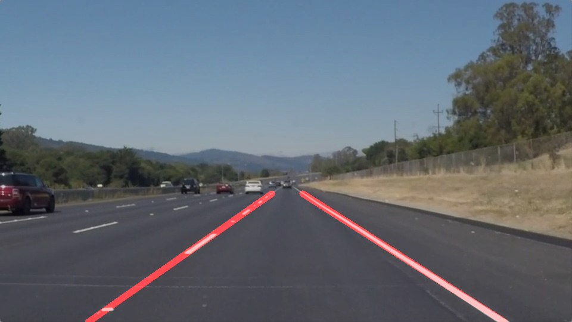
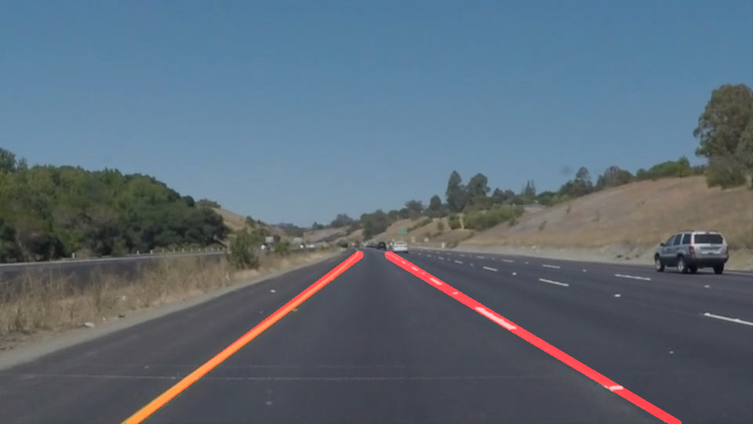
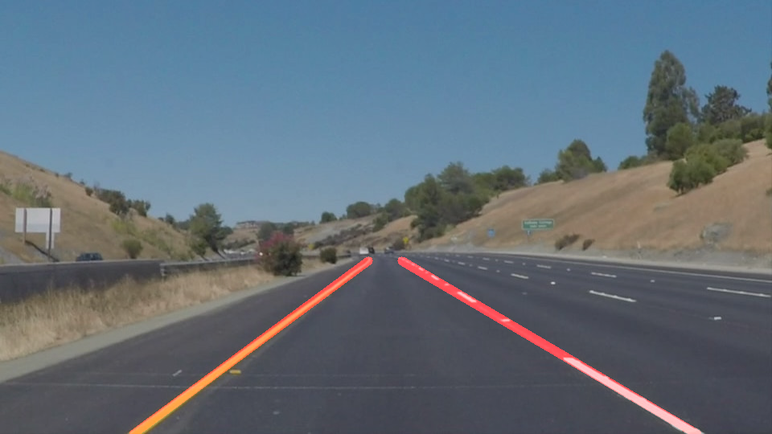
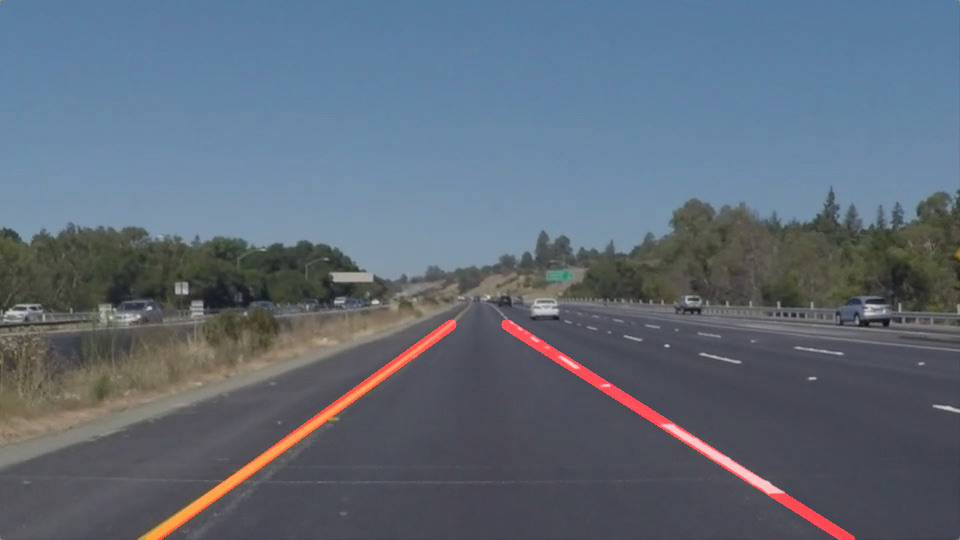
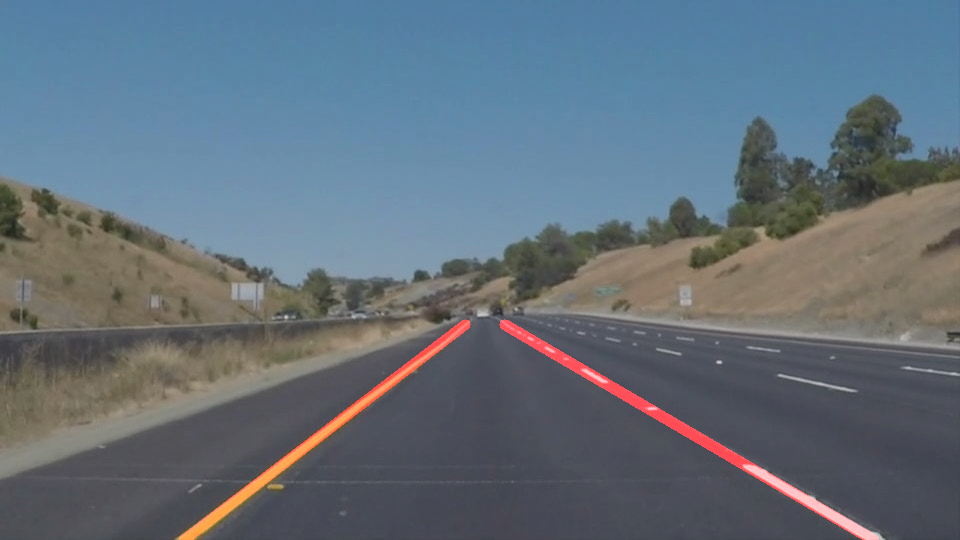

# Finding Lane Lines on the Road

## Writeup

---

**Finding Lane Lines on the Road**

The goals / steps of this project are the following:

* Make a pipeline that finds lane lines on the road
* Reflect on your work in a written report

---

### Reflection

#### 1. Describe your pipeline. As part of the description, explain how you modified the draw_lines() function.

My pipeline consisted of 6 steps.

1. I converted the image to **grayscale**.
2. I did **Gaussian Blur** with `kernel size` of *5*.
3. I did **Canny edge detection** with `low threshold` of *50* and `high threshold` of *150*.
4. I masked a quadrangular **region**.
5. I did **Hough transformation** by adjusting parameters many times and finally chose `rho` for *1*, `theta` for *numpy.pi / 180*, `threshold` for *20*, `min_line_len` for *10* and `max_line_gap` for *10*.
6. I **overlayed** masked lane lines on the original image.

In order to draw a single line on the left and right lanes, I modified the draw_lines() function by averaging and extrapolating the line segments.

* averaging segments by slope and midpoint
* weight - segment length over the sum of all segments length
* extrapolating endpoints with average slope and midpoint
* drawing single solid line with endpoints

#### 2. Identify potential shortcomings with your current pipeline

One potential shortcoming would be bad jitter when current pipeline applies to curve lines.

#### 3. Suggest possible improvements to your pipeline

A possible improvement would be to add a better curve fitting method for draw_lines() function.

### Reference

[Test Images Output](https://github.com/geminy/tr-adas/edit/master/P1_FindingLaneLines/test_images_output)

[Test Videos Output](https://github.com/geminy/tr-adas/edit/master/P1_FindingLaneLines/test_videos_output)

